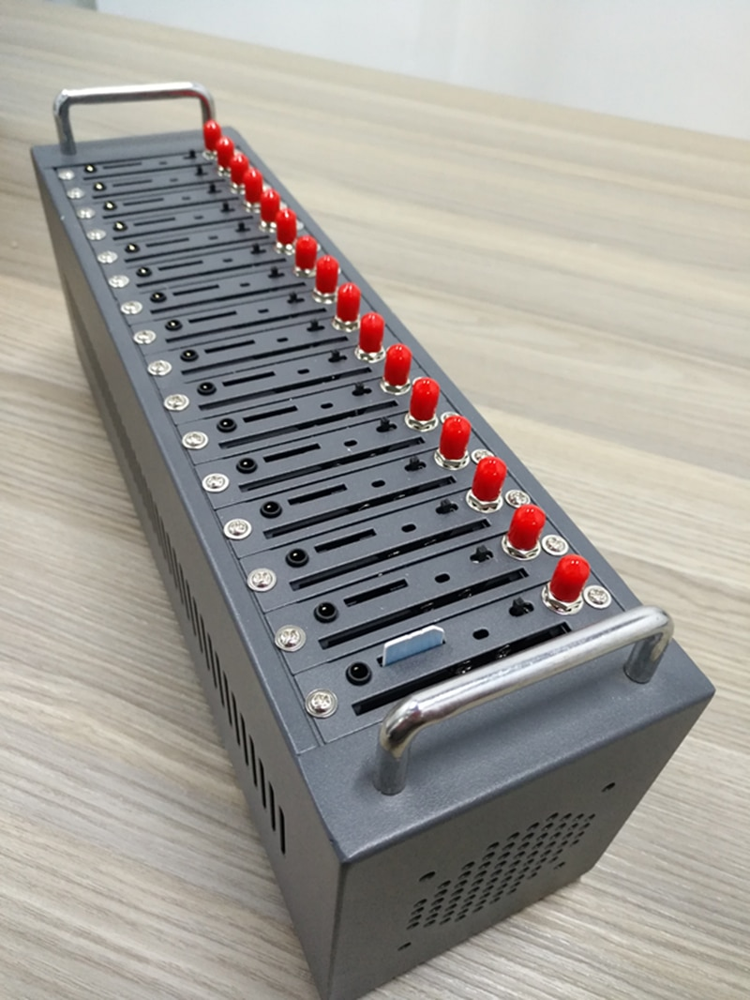

# Simtron

<p>
  
  Simtron is a SMS reception Slack Bot and Api software built on top of standard SIM5320e gsm and 3g modems serial connections through USB.
</p>

# Contribute

We prefer pull request, but you can also open an issue.

# Is Simtron needed in your workflow ?

Simtron can be extended to do whatever you need with a bunch of sim cards, imagine you have 16 mobile phones connected through USB to keep them charged and also to communicate with them. Then you need to listen to received SMS and react doing something usefull. Simtron can just automate that, avoiding all that mess of phones with sims you need to keep up and running.

In Tuenti, we have the following use case: we need to do login in our applications when developing new features and also when doing QA. In development, we can avoid that login most of the times; but, when testing, we need to use test accounts that behaves like real customers, also in login related stuff. These accounts uses "one use SMS code" based authentication.

So we started having lot of sim cards around the company, assigned to development teams and QA teams. We realized this wasn't efficient at all, all these sim card should be maintained and paid, so we decided to share the sim cards in a service tha allows to read and list SMS in a common company channel, reducing the amount of required cards.

To automate this task, we're using Simtron.

# Requirements

You will need following hardware:

- Multi SIM card module device, simtron is compatible with lot of hardware, take a look to the following picture. We've tested in hardware containing SIM5320e and SIM800l modems.

<p align="center">
  
</p>

- A PC or server having at least one USB 2.0 port and running linux (USB 3.0 is not recommended because of its hard limit of 32 devices per USB controller). Simtron can run on windows and mac too, but we have not tested in such operating systems.

# Installation

You will need **node 10** to run Simtron.

Just clone this repo and then execute:

```bash
npm install
```
Then, to start the service you will need **pm2** package to be globally installed:

```bash
npm install -g pm2
```

To make this installation works, you will need to set a file with basic configuration, all fields but slack token are optional. In repo root, put a file called **data/config.json**, with following content:

```javascript
{
    "bot": {
        "names": ["Simtron"], // all the names the bot will respond to.
    	  "slack": {
            "token": "YOUR SLACK INTEGRATION TOKEN",
            "adminUserIds": [...] // array of valid slack user ids.
        }
    },
    "countries": { // These entries are used to configure the sim card catalog, organized by country and operator.
        "ES": {
            "name": "Spain",
            "flag": ":flag-es:",
            "lineTypes": { // These are just operator name and sim card classification
                "Movistar": ["Tarjeta", "Contrato"],
                ...
            }
        }
        ...
    }
}
```

Depending on your system, to access USB ports you will need to run previous command as sudo, please do this on your own risk and responsibility. To avoid running as **sudo**, you should add the non sudoable linux user to **dialout** group, to do so, use following command:

```bash
sudo usermod -a -G dialout YOUR-USER
```

Last, just execute:

```bash
npm run start-service
```

This will show a new process running under **pm2** process manager. If you need Simtron to restart on every system restart, just type:

```bash
pm2 startup
```
To restart type:

```bash
pm2 restart simtron
```
To kill:

```bash
pm2 delete simtron
```

To see logs:

```bash
pm2 logs simtron
```

# Available command on the bot

For users:

## Read sim catalog

```
Simtron
```

This command displays the simcards catalog. If there are unregistered sim cards in use, this command will show them too, allowing to register properly if needed.

If some sim is not working properly, it will be ~~strikethrough~~

## Read sim details

```
Simtron details <phone number>
```

This command will display the ICC, msisdn and connection status of the sim identified by the given phone number.

For Admins:

## Register sim card in catalog

```
Simtron register <unregistered sim port's index>
```

This command starts a formulary to identify and then register all required sim data, just answer inline questions (single selection questions should be answered by typing the option number).

You can find **the unregister sim port's index** in the SIM catalog, being an **admin** user.

To cancel a registration process, just type:

```
Simtron forget it please
```

the **please** word is not required but, you know, we need to be gentile, also when talking to bots (remember terminator).

## Edit sim card data in catalog

```
Simtron edit <phone number>
```

This command edits previously registered sim cards' data. This process is also cancellable with same command.

## Enter pin code

```
Simtron enter pin <blocked sim port's index>
```

This command allows to enter a pin code to unblock a SIM card. This won't modify the SIM, this will simply enter the pin code every time the SIM requires it, untill you change the SIM to a new slot in the hardware, so please, avoid moving SIMs from one slot to another without real need.

If you need to move the SIM card to a new slot, you will need to enter the pin code again.

Please, make sure the used pin code is correct, if you enter it wrong, you can make the SIM require the PUK. By now, Simtron only allows to enter pin codes, to unblock a SIM that requires a PUK, you'll need to extract the SIM from Simtron and unblock it on a phone.

You will find the **blocked sim port's index** in SIM catalog output.

